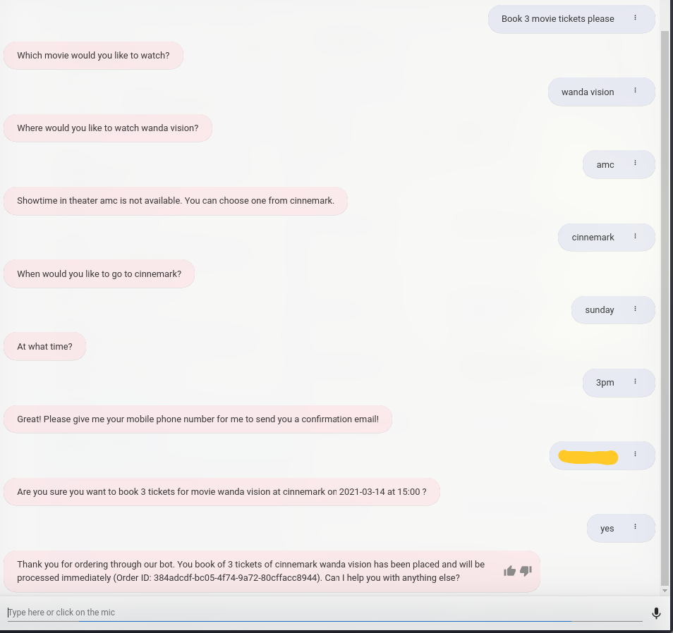

# Demo AWS Lex Chatbot

## Introduction

Amazon Lex is a service for building conversational interfaces into any application using voice and text.

It can be embedded in any website using a js snippet or server as a whole application

The project is intergrated with some of AWS toolkits in order to build a dynamic bot with dynamic data without rebuilding the bot

## Services Used

- Lex (Chatbot)
- Lambda ( Handle further Initialization, Validation and Fulfillent )
- SNS ( Send SMS )
- Cloud Formation (Host Lex bot)
- S3 (Create bukets)
- DynamoDB (Query and Put data)
- IAM (Config roles and permisisons)
- CloudWatch (Log errors)
- Cognito (create pool)

## Trigger Intents

My Booking Movie Ticket Boot has 3 intents as listed below

### BookTickets

<figure align="center">
  
  <figcaption>Utteraces</figcaption>
</figure>
<figure align="center">
  
  <figcaption>Slots</figcaption>
</figure>

### GetTheater

<figure align="center">
  
  <figcaption>Utteraces</figcaption>
</figure>
<figure align="center">
  
  <figcaption>Slots</figcaption>
</figure>

### Help

Buit-in Lex intent

## Lambda Functionex (Chatbot)

- Lambda ( Handle Initialization, Validation and Fulfillent further)
- SNS ( Send SMS )
- Cloud Formation (Host Lex bot)
- S3 (Create bukets)
- DynamoDB (Query and Put data)
- IAM (Config roles and permisisons)
- CloudWatch (Log errors)
- Cognito (create pool)

## Trigger Intents

My Booking Movie Ticket Boot has 3 intents as listed below

### BookTickets

<figure align="center">
  
  <figcaption align="center">Utteraces</figcaption>
</figure>
<figure align="center">
  
  <figcaption align="center">Slots</figcaption>
</figure>

### GetTheater

<figure align="center">
  
  <figcaption align="center">Utteraces</figcaption>
</figure>
<figure align="center">
  
  <figcaption align="center">Slots</figcaption>
</figure>

### Help

Buit-in Lex intent

## Lambda Function

Perform further initialization, validation and fulfillment in lex.

If the validation process sends a success message, the chatbot will ask the next question to fulfill the remaining slots. Otherwise, it will ask for confirmation then end the session.

If any slot has data that doesn't exist in the database, it will send an Elicit Slot Action Type and ask the user to input data again.

Max invalid data entering per intent is 2 (customizable). If entered data is invalid in 3 rounds of input, end the session.

### Validation

It performs the following user inputs validation.

- MovieName slot should be in a pre-defined list ( in the real application it will call a backend server and get an available list of movies)

- TheaterName slot should be in DynamoDB associated with MovieName slot (movie table)

- Users can book up to 1-month tickets in advance from today's sales

- The number of ticket bookings is bound from 1 to maximum booking up to 10

- Implemented for basics validation for mobile number

- When the bot has all the checked slots, check if movie_id has existed in the database. If it doesn't, end the current session

### Confirmation state

#### Yes

- Save the order to order table
- If the number starts with +1 then send a confirmation SMS with booking details
- Push a confirmation prompt

#### No

- Push a confirmation prompt

## Cloud Formation for LEX

The UI of the chatbot is created by using the [aws-lex-web-ui](https://github.com/aws-samples/aws-lex-web-ui) project. The project provides a cloud formation stack that creates a static website on the S3 bucket for the chatbot web UI.

## Demo

